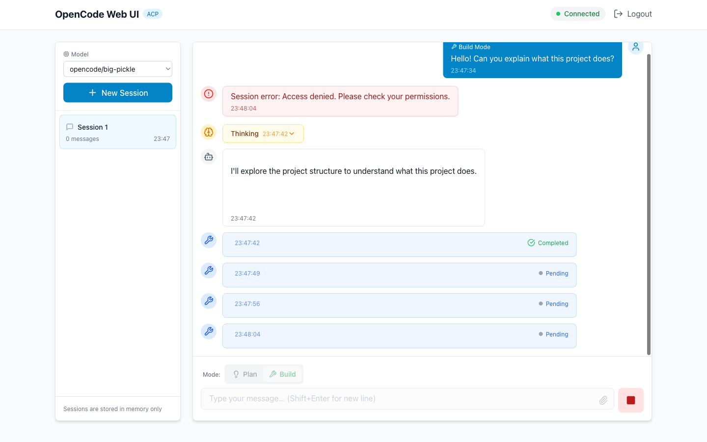
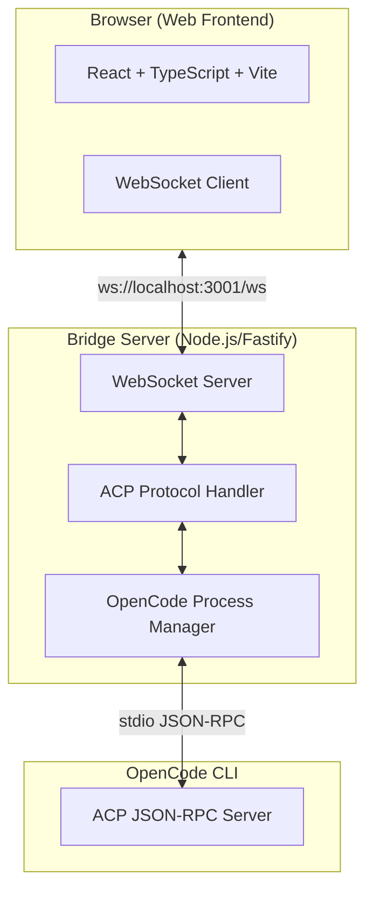

# OpenCode Web UI with ACP

[](./package.json)
[](https://reactjs.org/)
[](https://www.typescriptlang.org/)
[](https://www.fastify.io/)
[](https://developer.mozilla.org/en-US/docs/Web/API/WebSocket)
[](https://www.docker.com/)
[](./LICENSE)

A browser-based remote GUI for [OpenCode](https://opencode.ai) that leverages the Agent Client Protocol (ACP) to enable real-time streaming interactions from any web browser.


*Chat interface with session management, tool call visualization, and real-time streaming*

## Features

- **Real-time Streaming** - Live chat with WebSocket-based bidirectional communication
- **Session Management** - Create, switch, and manage multiple AI conversation sessions
- **Agent Modes** - Toggle between Plan (analysis) and Build (implementation) modes
- **Tool Call Visualization** - Visual display of AI tool usage with status indicators
- **Permission Handling** - Interactive UI for approving/denying agent tool requests
- **File Upload Support** - Upload files to share with the AI (UI ready, backend pending)
- **Multi-Model Support** - Choose from available AI models configured in OpenCode
- **JWT Authentication** - Secure token-based authentication with refresh capability
- **Docker Deployment** - Full containerization with docker-compose for easy deployment

## Architecture



This project consists of three main components:

1. **Bridge Server** (`apps/bridge/`): Node.js server that translates between ACP's JSON-RPC over stdio and WebSocket for browser consumption
2. **Web Frontend** (`apps/web/`): React-based chat interface for interacting with OpenCode
3. **Shared Types** (`packages/shared/`): TypeScript type definitions shared between frontend and backend

```
Browser → WebSocket → Bridge Server → opencode acp (stdio)
```

## Quick Start

### Prerequisites

- Node.js 22+ with pnpm
- OpenCode CLI installed (`opencode --version`)

### Installation

```bash
# Install dependencies
pnpm install

# Build shared packages
pnpm --filter @opencode/shared build

# Start bridge server
pnpm --filter @opencode/bridge dev

# In another terminal, start web frontend
pnpm --filter @opencode/web dev
```

Or start all services at once:

```bash
pnpm dev
```

### Using Docker

```bash
# Start all services
pnpm docker:up

# Or start development version with hot reload
pnpm docker:dev
```

### Demo Login

Use the following credentials to log in:
- **Username**: `demo`
- **Password**: `demo`

Then navigate to `http://localhost:5173` to access the web interface.

## Development

### Project Structure

```
.
├── apps/
│   ├── bridge/          # Bridge server (Node.js + Fastify + WebSocket)
│   │   ├── src/
│   │   │   ├── server.ts              # Fastify server setup
│   │   │   ├── routes/                # HTTP routes (auth, health)
│   │   │   ├── websocket/             # WebSocket handlers
│   │   │   ├── acp/                   # ACP protocol handler
│   │   │   │   ├── ACPProtocolHandler.ts    # Main ACP translator
│   │   │   │   └── OpenCodeProcessManager.ts # Process management
│   │   │   ├── types.ts               # TypeScript types
│   │   │   └── utils/                 # Utilities (logger, etc.)
│   └── web/             # React frontend (Vite + TypeScript)
│       ├── src/
│       │   ├── components/            # React components
│       │   ├── contexts/              # React contexts
│       │   │   ├── WebSocketContext.tsx   # WebSocket connection
│       │   │   └── ACPContext.tsx         # ACP state management
│       │   ├── hooks/                 # Custom React hooks
│       │   ├── pages/                 # Route pages
│       │   ├── types.ts               # TypeScript types
│       │   └── utils/                 # Utilities
├── packages/
│   ├── shared/          # Shared types and utilities
│   └── config/          # Shared ESLint + TS configs
├── tests/e2e/           # Playwright end-to-end tests
├── docker-compose.yml   # Docker orchestration
└── package.json         # Root monorepo config
```

### Available Scripts

- `pnpm dev` - Start all services in development mode
- `pnpm build` - Build all packages
- `pnpm test` - Run all tests
- `pnpm test:watch` - Run tests in watch mode
- `pnpm typecheck` - Run TypeScript checks
- `pnpm lint` - Run ESLint
- `pnpm lint:fix` - Fix ESLint issues
- `pnpm docker:up` - Start Docker containers
- `pnpm docker:down` - Stop Docker containers
- `pnpm docker:build` - Build Docker containers

### Tech Stack

| Component | Technology |
|-----------|------------|
| Frontend | React 19, TypeScript 5.7, Vite |
| Styling | Tailwind CSS, Lucide Icons |
| Backend | Node.js, Fastify 5, WebSocket |
| Testing | Vitest (unit), Playwright (E2E) |
| Protocol | ACP (Agent Client Protocol) over WebSocket |
| Container | Docker, Docker Compose |

## Security

This project implements security best practices:

- **JWT Authentication** - Token-based auth with refresh capability
- **CORS Protection** - Configurable allowed origins
- **Helmet Security Headers** - CSP, XSS protection, etc.
- **Rate Limiting** - 100 requests per 15 minutes (configurable)
- **Input Validation** - Zod schemas for all messages
- **No Secrets in Code** - Environment variables for sensitive data

### Production Deployment Checklist

Before deploying to production:

- [ ] Change the JWT secret (`JWT_SECRET` env var) to a strong random value
- [ ] Implement proper user authentication (replace demo auth)
- [ ] Enable HTTPS/WSS for secure connections
- [ ] Configure CORS origins to match your domain
- [ ] Add session persistence (Redis/Database)
- [ ] Set up proper logging and monitoring
- [ ] Review and tighten rate limiting settings
- [ ] Run security audit: `pnpm audit`

## Environment Variables

### Bridge Server (`.env` in `apps/bridge/`)

```bash
PORT=3001
JWT_SECRET=your-super-secret-jwt-key-change-this-in-production
CORS_ORIGIN=http://localhost:5173
LOG_LEVEL=info
RATE_LIMIT_MAX=100
RATE_LIMIT_WINDOW_MS=900000
```

### Web Frontend (`.env` in `apps/web/`)

```bash
VITE_BRIDGE_URL=ws://localhost:3001
VITE_LOG_LEVEL=info
```

## Contributing

We welcome contributions! Please see our [Contributing Guide](./CONTRIBUTING.md) for details.

For developers working on this codebase, please refer to [AGENTS.md](./AGENTS.md) for detailed development guidelines including:
- Architecture and state management patterns
- Code style guidelines
- Testing patterns and examples
- Common debugging workflows
- Commit message conventions

## Resources

- [ACP Protocol Specification](https://agentclientprotocol.com/)
- [OpenCode Documentation](https://opencode.ai/docs/)
- [Architecture Research](./research/mermaid-diagrams-index.md)
- [Implementation Plan](./docs/plans/2026-02-01-implementation-plan.md)

## License

MIT License - see [LICENSE](./LICENSE) file

## Changelog

See [CHANGELOG.md](./CHANGELOG.md) for version history and release notes.
