# Agent Client Protocol (ACP) - Research Document

## Executive Summary

The **Agent Client Protocol (ACP)** is a JSON-RPC 2.0 based protocol that standardizes communication between code editors (clients) and AI coding agents. It was developed by Zed Industries and enables seamless integration of AI agents into any compatible editor without vendor lock-in.

---

## 1. Protocol Architecture

### 1.1 Communication Model

ACP follows the JSON-RPC 2.0 specification with two types of messages:

- **Methods**: Request-response pairs that expect a result or error
- **Notifications**: One-way messages that don't expect a response

### 1.2 Transport Mechanisms

| Transport | Use Case | Description |
|-----------|----------|-------------|
| **stdio** | Primary | Standard input/output for subprocess communication |
| **TCP** | Network | TCP socket connections for remote agents |
| **WebSocket** | Web UIs | Full-duplex communication for browser-based clients |

### 1.3 Protocol Flow

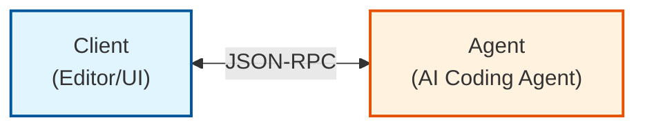

**Typical Message Flow:**

```mermaid
sequenceDiagram
    participant C as Client
    participant A as Agent
    
    Note over C,A: Initialization Phase
    C->>A: initialize
    A-->>C: InitializeResponse
    
    opt Authentication Required
        C->>A: authenticate
        A-->>C: AuthenticateResponse
    end
    
    Note over C,A: Session Setup
    C->>A: session/new
    A-->>C: NewSessionResponse
    
    Note over C,A: Prompt Turn
    C->>A: session/prompt
    
    loop Streaming Updates
        A-->>C: session/update (message chunk)
    end
    
    opt Tool Authorization Required
        A->>C: session/request_permission
        C-->>A: RequestPermissionResponse
    end
    
    A-->>C: PromptResponse (stopReason)

---

## 2. Message Structure

### 2.1 JSON-RPC 2.0 Format

**Request:**
```json
{
  "jsonrpc": "2.0",
  "id": 1,
  "method": "initialize",
  "params": {
    "protocolVersion": 1,
    "clientCapabilities": {},
    "clientInfo": {
      "name": "MyEditor",
      "version": "1.0.0"
    }
  }
}
```

**Response:**
```json
{
  "jsonrpc": "2.0",
  "id": 1,
  "result": {
    "protocolVersion": 1,
    "agentCapabilities": {},
    "agentInfo": {
      "name": "OpenCode",
      "version": "1.0.0"
    }
  }
}
```

**Error Response:**
```json
{
  "jsonrpc": "2.0",
  "id": 1,
  "error": {
    "code": -32600,
    "message": "Invalid Request"
  }
}
```

**Notification:**
```json
{
  "jsonrpc": "2.0",
  "method": "session/update",
  "params": {
    "sessionId": "abc123",
    "update": {
      "sessionUpdate": "agent_message_chunk",
      "content": {
        "type": "text",
        "text": "Hello, I'm analyzing your code..."
      }
    }
  }
}
```

### 2.2 Content Blocks

ACP uses typed content blocks for multi-modal communication:

| Type | Description | Required Capability |
|------|-------------|---------------------|
| `text` | Plain text or Markdown | Baseline |
| `image` | Base64-encoded images | `image` |
| `audio` | Audio data for transcription | `audio` |
| `resource` | Embedded file/resource | Baseline |
| `resource_link` | Reference to external resource | Baseline |

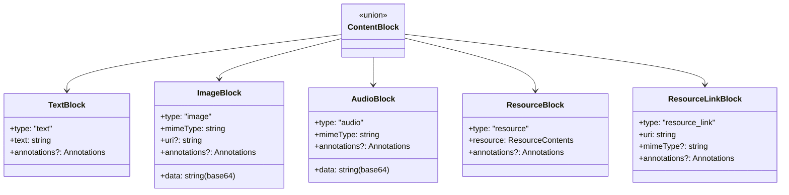

---

## 3. Session Lifecycle

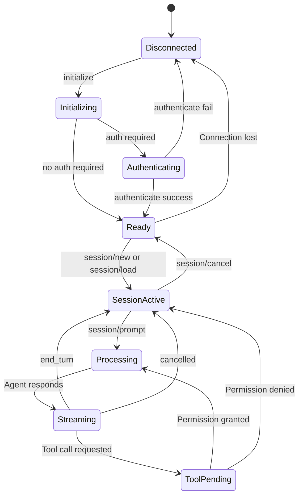

---

## 4. Event Types & Payloads

### 3.1 Connection-Level Events

#### `initialize`

**Purpose:** Establish connection and negotiate capabilities

**Request:**
```json
{
  "jsonrpc": "2.0",
  "id": 1,
  "method": "initialize",
  "params": {
    "protocolVersion": 1,
    "clientCapabilities": {
      "fs": {
        "readTextFile": true,
        "writeTextFile": false
      },
      "terminal": false
    },
    "clientInfo": {
      "name": "Zed",
      "version": "0.170.0"
    },
    "_meta": {}
  }
}
```

**Response:**
```json
{
  "jsonrpc": "2.0",
  "id": 1,
  "result": {
    "protocolVersion": 1,
    "agentCapabilities": {
      "loadSession": true,
      "mcpCapabilities": {
        "http": false,
        "sse": false
      },
      "promptCapabilities": {
        "audio": false,
        "embeddedContext": false,
        "image": true
      }
    },
    "agentInfo": {
      "name": "OpenCode",
      "version": "1.0.162"
    },
    "authMethods": []
  }
}
```

---

#### `authenticate`

**Purpose:** Authenticate with the agent (if required)

**Request:**
```json
{
  "jsonrpc": "2.0",
  "id": 2,
  "method": "authenticate",
  "params": {
    "methodId": "api_key"
  }
}
```

**Response:**
```json
{
  "jsonrpc": "2.0",
  "id": 2,
  "result": {}
}
```

---

### 3.2 Session Management Events

#### `session/new`

**Purpose:** Create a new conversation session

**Request:**
```json
{
  "jsonrpc": "2.0",
  "id": 3,
  "method": "session/new",
  "params": {
    "cwd": "/home/user/project",
    "mcpServers": [
      {
        "name": "filesystem",
        "command": "npx",
        "args": ["-y", "@modelcontextprotocol/server-filesystem", "/home/user/project"]
      }
    ],
    "_meta": {}
  }
}
```

**Response:**
```json
{
  "jsonrpc": "2.0",
  "id": 3,
  "result": {
    "sessionId": "sess_abc123xyz",
    "configOptions": [
      {
        "id": "model",
        "name": "Model",
        "values": [
          {"id": "claude-sonnet-4", "name": "Claude Sonnet 4"},
          {"id": "gpt-4", "name": "GPT-4"}
        ],
        "currentValue": "claude-sonnet-4"
      }
    ],
    "modes": {
      "availableModes": [
        {"id": "ask", "name": "Ask"},
        {"id": "code", "name": "Code"}
      ],
      "currentMode": "ask"
    }
  }
}
```

---

#### `session/load`

**Purpose:** Resume an existing session (requires `loadSession` capability)

**Request:**
```json
{
  "jsonrpc": "2.0",
  "id": 4,
  "method": "session/load",
  "params": {
    "sessionId": "sess_abc123xyz",
    "cwd": "/home/user/project",
    "mcpServers": []
  }
}
```

**Response:** Same as `session/new`

---

#### `session/cancel` (Notification)

**Purpose:** Cancel ongoing operations

**Payload:**
```json
{
  "jsonrpc": "2.0",
  "method": "session/cancel",
  "params": {
    "sessionId": "sess_abc123xyz",
    "_meta": {}
  }
}
```

---

### 3.3 Prompt & Message Events

#### `session/prompt`

**Purpose:** Send a user prompt to the agent

**Request:**
```json
{
  "jsonrpc": "2.0",
  "id": 5,
  "method": "session/prompt",
  "params": {
    "sessionId": "sess_abc123xyz",
    "prompt": [
      {
        "type": "text",
        "text": "Explain this code"
      },
      {
        "type": "resource",
        "resource": {
          "uri": "file:///home/user/project/src/main.ts",
          "mimeType": "text/plain",
          "text": "console.log('Hello World');"
        }
      }
    ],
    "_meta": {}
  }
}
```

**Response:**
```json
{
  "jsonrpc": "2.0",
  "id": 5,
  "result": {
    "stopReason": "end_turn"
  }
}
```

**Stop Reasons:**
| Value | Description |
|-------|-------------|
| `end_turn` | Agent completed its response |
| `tool_use` | Agent wants to use a tool |
| `cancelled` | Turn was cancelled by client |
| `error` | An error occurred |

---

#### `session/update` (Notification - Agent → Client)

**Purpose:** Stream real-time updates during prompt processing

**SessionUpdate Types:**

**1. Agent Message Chunk:**
```json
{
  "jsonrpc": "2.0",
  "method": "session/update",
  "params": {
    "sessionId": "sess_abc123xyz",
    "update": {
      "sessionUpdate": "agent_message_chunk",
      "content": {
        "type": "text",
        "text": "I'll analyze this code for you."
      }
    }
  }
}
```

**2. Thought Chunk:**
```json
{
  "jsonrpc": "2.0",
  "method": "session/update",
  "params": {
    "sessionId": "sess_abc123xyz",
    "update": {
      "sessionUpdate": "thought_chunk",
      "content": {
        "type": "text",
        "text": "The user wants me to explain a simple console.log statement..."
      }
    }
  }
}
```

**3. Tool Call:**
```json
{
  "jsonrpc": "2.0",
  "method": "session/update",
  "params": {
    "sessionId": "sess_abc123xyz",
    "update": {
      "sessionUpdate": "tool_call",
      "toolCall": {
        "toolCallId": "call_123",
        "toolName": "read_file",
        "arguments": {
          "path": "/home/user/project/src/main.ts"
        },
        "status": "pending"
      }
    }
  }
}
```

**4. Tool Call Update:**
```json
{
  "jsonrpc": "2.0",
  "method": "session/update",
  "params": {
    "sessionId": "sess_abc123xyz",
    "update": {
      "sessionUpdate": "tool_call_update",
      "toolCall": {
        "toolCallId": "call_123",
        "status": "completed",
        "result": {
          "type": "text",
          "text": "console.log('Hello World');"
        }
      }
    }
  }
}
```

**5. Execution Plan:**
```json
{
  "jsonrpc": "2.0",
  "method": "session/update",
  "params": {
    "sessionId": "sess_abc123xyz",
    "update": {
      "sessionUpdate": "plan",
      "plan": {
        "steps": [
          {"id": "1", "description": "Read the file contents"},
          {"id": "2", "description": "Analyze the code structure"},
          {"id": "3", "description": "Provide explanation"}
        ]
      }
    }
  }
}
```

**6. Available Commands Update:**
```json
{
  "jsonrpc": "2.0",
  "method": "session/update",
  "params": {
    "sessionId": "sess_abc123xyz",
    "update": {
      "sessionUpdate": "available_commands",
      "availableCommands": [
        {
          "name": "create_plan",
          "description": "Create an execution plan for the task",
          "input": {
            "unstructured": {
              "hint": "Describe the task..."
            }
          }
        }
      ]
    }
  }
}
```

**7. Mode Change:**
```json
{
  "jsonrpc": "2.0",
  "method": "session/update",
  "params": {
    "sessionId": "sess_abc123xyz",
    "update": {
      "sessionUpdate": "current_mode_update",
      "currentMode": "code"
    }
  }
}
```

**8. Config Options Update:**
```json
{
  "jsonrpc": "2.0",
  "method": "session/update",
  "params": {
    "sessionId": "sess_abc123xyz",
    "update": {
      "sessionUpdate": "config_options",
      "configOptions": [
        {
          "id": "model",
          "name": "Model",
          "currentValue": "gpt-4"
        }
      ]
    }
  }
}
```

**Session Update Types Hierarchy:**
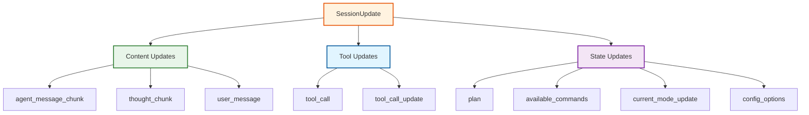

---

### 3.4 Permission Events

#### `session/request_permission` (Agent → Client)

**Purpose:** Request user authorization for tool calls

**Request:**
```json
{
  "jsonrpc": "2.0",
  "id": 10,
  "method": "session/request_permission",
  "params": {
    "sessionId": "sess_abc123xyz",
    "toolCall": {
      "toolCallId": "call_123",
      "toolName": "write_file",
      "arguments": {
        "path": "/home/user/project/src/main.ts",
        "content": "..."
      }
    },
    "options": [
      {
        "optionId": "allow_once",
        "title": "Allow Once",
        "description": "Allow this operation one time"
      },
      {
        "optionId": "allow_always",
        "title": "Always Allow",
        "description": "Allow all future operations of this type"
      },
      {
        "optionId": "deny",
        "title": "Deny",
        "description": "Don't allow this operation"
      }
    ],
    "_meta": {}
  }
}
```

**Response:**
```json
{
  "jsonrpc": "2.0",
  "id": 10,
  "result": {
    "outcome": {
      "outcome": "selected",
      "optionId": "allow_once"
    }
  }
}
```

**Outcomes:**
| Outcome | Description |
|---------|-------------|
| `selected` | User selected an option |
| `cancelled` | User cancelled the request |
| `timeout` | Request timed out |

**Complete Tool Call Flow:**
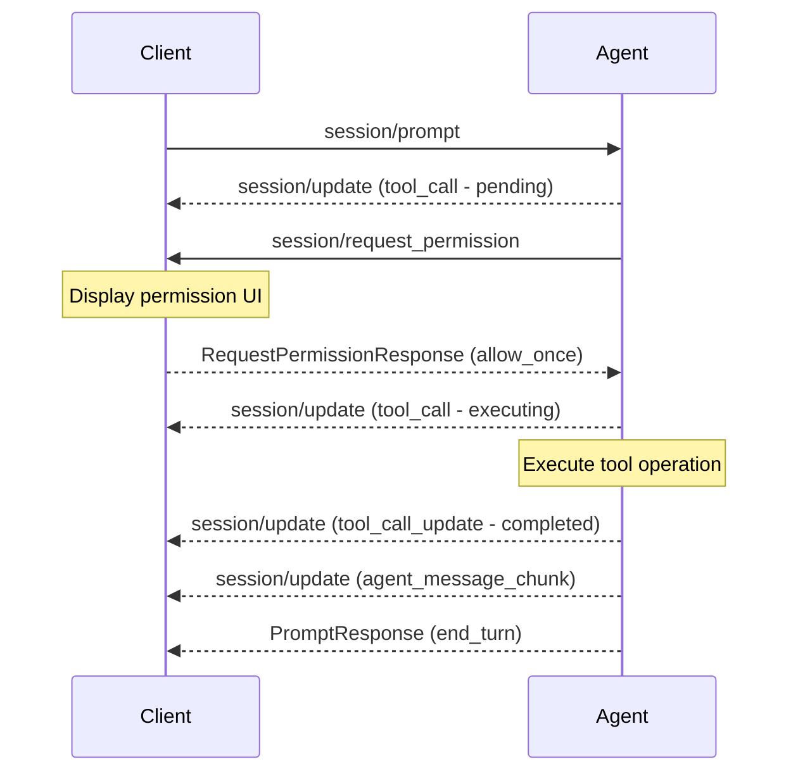

---

### 3.5 File System Events

#### `fs/read_text_file`

**Purpose:** Read content from a text file

**Request:**
```json
{
  "jsonrpc": "2.0",
  "id": 11,
  "method": "fs/read_text_file",
  "params": {
    "sessionId": "sess_abc123xyz",
    "path": "/home/user/project/README.md",
    "line": 1,
    "limit": 50,
    "_meta": {}
  }
}
```

**Response:**
```json
{
  "jsonrpc": "2.0",
  "id": 11,
  "result": {
    "content": "# Project README\n\nThis is a sample project."
  }
}
```

---

#### `fs/write_text_file`

**Purpose:** Write content to a text file

**Request:**
```json
{
  "jsonrpc": "2.0",
  "id": 12,
  "method": "fs/write_text_file",
  "params": {
    "sessionId": "sess_abc123xyz",
    "path": "/home/user/project/src/newfile.ts",
    "content": "export const greeting = 'Hello';",
    "_meta": {}
  }
}
```

**Response:**
```json
{
  "jsonrpc": "2.0",
  "id": 12,
  "result": {}
}
```

---

### 3.6 Terminal Events

#### `terminal/create`

**Purpose:** Create a new terminal and execute a command

**Request:**
```json
{
  "jsonrpc": "2.0",
  "id": 13,
  "method": "terminal/create",
  "params": {
    "sessionId": "sess_abc123xyz",
    "command": "npm",
    "args": ["install"],
    "cwd": "/home/user/project",
    "env": [
      {"name": "NODE_ENV", "value": "development"}
    ],
    "outputByteLimit": 100000,
    "_meta": {}
  }
}
```

**Response:**
```json
{
  "jsonrpc": "2.0",
  "id": 13,
  "result": {
    "terminalId": "term_abc123"
  }
}
```

---

#### `terminal/output`

**Purpose:** Get terminal output and exit status

**Request:**
```json
{
  "jsonrpc": "2.0",
  "id": 14,
  "method": "terminal/output",
  "params": {
    "sessionId": "sess_abc123xyz",
    "terminalId": "term_abc123",
    "_meta": {}
  }
}
```

**Response:**
```json
{
  "jsonrpc": "2.0",
  "id": 14,
  "result": {
    "output": "added 42 packages in 2s\n",
    "exitStatus": {
      "exitCode": 0
    },
    "truncated": false
  }
}
```

---

#### `terminal/wait_for_exit`

**Purpose:** Wait for terminal command to exit

**Request:**
```json
{
  "jsonrpc": "2.0",
  "id": 15,
  "method": "terminal/wait_for_exit",
  "params": {
    "sessionId": "sess_abc123xyz",
    "terminalId": "term_abc123"
  }
}
```

**Response:**
```json
{
  "jsonrpc": "2.0",
  "id": 15,
  "result": {
    "exitCode": 0
  }
}
```

---

#### `terminal/kill`

**Purpose:** Kill terminal command without releasing

**Request:**
```json
{
  "jsonrpc": "2.0",
  "id": 16,
  "method": "terminal/kill",
  "params": {
    "sessionId": "sess_abc123xyz",
    "terminalId": "term_abc123"
  }
}
```

---

#### `terminal/release`

**Purpose:** Release a terminal and free resources

**Request:**
```json
{
  "jsonrpc": "2.0",
  "id": 17,
  "method": "terminal/release",
  "params": {
    "sessionId": "sess_abc123xyz",
    "terminalId": "term_abc123"
  }
}
```

---

### 3.7 Session Mode Events

#### `session/set_mode`

**Purpose:** Set the current agent mode

**Request:**
```json
{
  "jsonrpc": "2.0",
  "id": 18,
  "method": "session/set_mode",
  "params": {
    "sessionId": "sess_abc123xyz",
    "modeId": "code"
  }
}
```

**Response:**
```json
{
  "jsonrpc": "2.0",
  "id": 18,
  "result": {}
}
```

---

### 3.8 Session Configuration Events

#### `session/set_config_option`

**Purpose:** Set a session configuration option

**Request:**
```json
{
  "jsonrpc": "2.0",
  "id": 19,
  "method": "session/set_config_option",
  "params": {
    "sessionId": "sess_abc123xyz",
    "configId": "model",
    "value": "gpt-4"
  }
}
```

**Response:**
```json
{
  "jsonrpc": "2.0",
  "id": 19,
  "result": {
    "configOptions": [
      {
        "id": "model",
        "name": "Model",
        "values": [...],
        "currentValue": "gpt-4"
      }
    ]
  }
}
```

---

## 5. Capabilities

### 4.1 Client Capabilities

```typescript
interface ClientCapabilities {
  fs?: {
    readTextFile: boolean;
    writeTextFile: boolean;
  };
  terminal?: boolean;
}
```

### 4.2 Agent Capabilities

```typescript
interface AgentCapabilities {
  loadSession?: boolean;
  mcpCapabilities?: {
    http: boolean;
    sse: boolean;
  };
  promptCapabilities?: {
    audio: boolean;
    embeddedContext: boolean;
    image: boolean;
  };
  sessionCapabilities?: {
    modes?: boolean;
    configOptions?: boolean;
  };
}
```

---

## 6. OpenCode ACP Implementation

### 6.1 Starting the ACP Server

OpenCode can be started as an ACP server using the `acp` command:

```bash
# stdio mode (default, recommended for IDE integration)
opencode acp

# Explicit stdio mode
opencode acp --stdio

# TCP mode
opencode acp --port 3000
```

### 6.2 Editor Configurations

**Zed:**
```json
{
  "agent_servers": {
    "OpenCode": {
      "command": "opencode",
      "args": ["acp"]
    }
  }
}
```

**JetBrains IDEs:**
```json
{
  "agent_servers": {
    "OpenCode": {
      "command": "/absolute/path/bin/opencode",
      "args": ["acp"]
    }
  }
}
```

**Avante.nvim:**
```lua
{
  acp_providers = {
    ["opencode"] = {
      command = "opencode",
      args = { "acp" },
      env = {
        OPENCODE_API_KEY = os.getenv("OPENCODE_API_KEY")
      }
    }
  }
}
```

**CodeCompanion.nvim:**
```lua
require("codecompanion").setup({
  interactions = {
    chat = {
      adapter = {
        name = "opencode",
        model = "claude-sonnet-4",
      },
    },
  },
})
```

### 6.3 Supported Features

When using OpenCode via ACP, all features are supported:

- Built-in tools (file operations, terminal commands, etc.)
- Custom tools and slash commands
- MCP servers configured in OpenCode config
- Project-specific rules from `AGENTS.md`
- Custom formatters and linters
- Agents and permissions system
- Multi-modal content (text, images)

**Note:** Some built-in slash commands like `/undo` and `/redo` are currently unsupported.

**OpenCode ACP Architecture:**
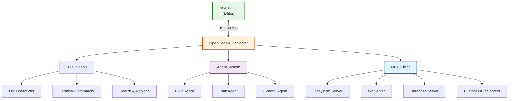

---

## 7. Bridge Architecture for Chat UI

### 6.1 Architecture Overview

A bridge server enables communication between an ACP agent and a web-based chat UI:

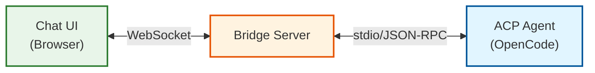

### 7.2 Bridge Components

#### 1. ACP Process Manager

Spawns and manages the ACP agent subprocess:

```typescript
interface ACPProcessManager {
  spawnAgent(command: string, args: string[], cwd: string): Promise<ChildProcess>;
  writeToStdin(message: JSONRPCMessage): void;
  onStdout(callback: (data: string) => void): void;
  onStderr(callback: (data: string) => void): void;
  kill(): void;
}
```

#### 2. WebSocket Server

Handles client connections from the chat UI:

```typescript
interface WebSocketServer {
  onConnection(callback: (client: WebSocketClient) => void): void;
  broadcast(message: BridgeMessage): void;
  sendToClient(clientId: string, message: BridgeMessage): void;
}
```

#### 3. Message Translator

Translates between ACP JSON-RPC and WebSocket formats:

```typescript
interface MessageTranslator {
  // ACP → WebSocket
  translateACPUpdate(update: SessionUpdate): UIEvent;
  
  // WebSocket → ACP
  translateUserInput(input: UserInput): PromptRequest;
}
```

#### 4. Bridge Component Class Diagram

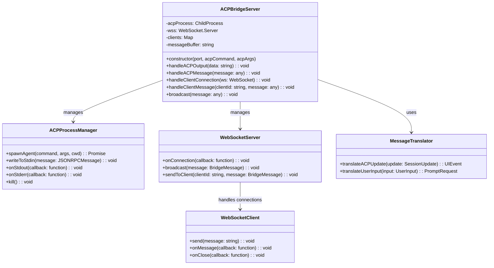

### 7.3 Message Flow

**User Sends Message:**
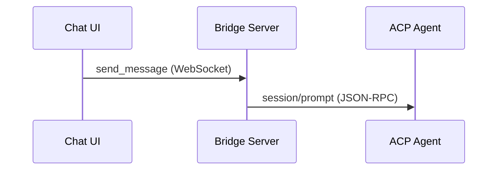

**Agent Streams Response:**
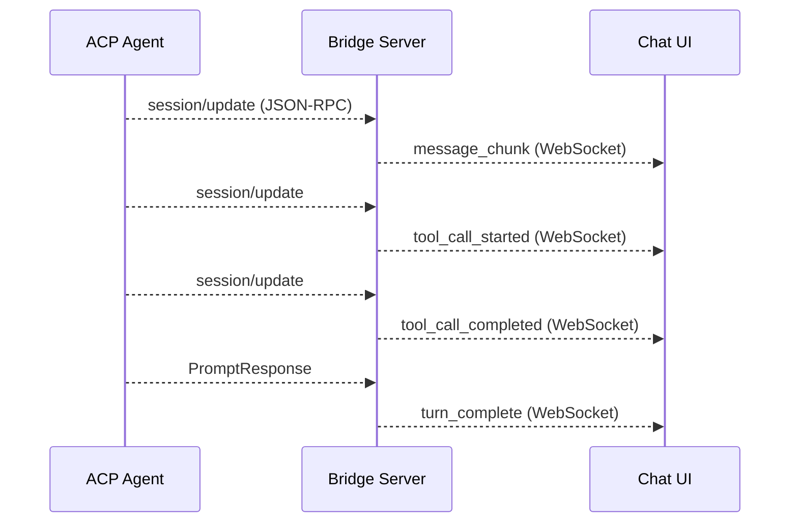

**Permission Request Flow:**
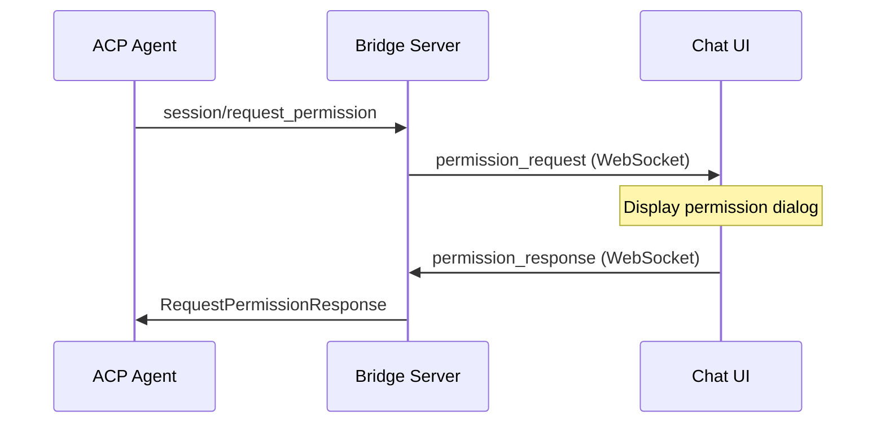

### 7.4 Bridge Event Types

#### From Bridge to Chat UI:

| Event | Description |
|-------|-------------|
| `message_chunk` | Streaming text response |
| `tool_call_started` | Agent started using a tool |
| `tool_call_completed` | Agent finished using a tool |
| `permission_request` | User permission needed |
| `terminal_output` | Terminal command output |
| `plan_created` | Execution plan generated |
| `mode_changed` | Agent mode changed |
| `error` | Error occurred |

#### From Chat UI to Bridge:

| Event | Description |
|-------|-------------|
| `send_message` | User message |
| `cancel_turn` | Cancel current turn |
| `permission_response` | User permission decision |
| `change_mode` | Change agent mode |
| `load_session` | Load existing session |
| `new_session` | Create new session |

### 7.5 Implementation Example

**Bridge Server (TypeScript/Node.js):**

```typescript
import { spawn } from 'child_process';
import WebSocket from 'ws';

class ACPBridgeServer {
  private acpProcess: ReturnType<typeof spawn>;
  private wss: WebSocket.Server;
  private clients: Map<string, WebSocket> = new Map();
  private messageBuffer: string = '';

  constructor(port: number, acpCommand: string, acpArgs: string[]) {
    // Start WebSocket server
    this.wss = new WebSocket.Server({ port });
    this.wss.on('connection', this.handleClientConnection.bind(this));

    // Spawn ACP agent
    this.acpProcess = spawn(acpCommand, acpArgs, {
      stdio: ['pipe', 'pipe', 'pipe']
    });

    // Handle ACP stdout (NDJSON)
    this.acpProcess.stdout?.on('data', (data: Buffer) => {
      this.handleACPOutput(data.toString());
    });
  }

  private handleACPOutput(data: string): void {
    // NDJSON parsing - messages separated by newlines
    this.messageBuffer += data;
    const lines = this.messageBuffer.split('\n');
    this.messageBuffer = lines.pop() || ''; // Keep incomplete line

    for (const line of lines) {
      if (line.trim()) {
        try {
          const message = JSON.parse(line);
          this.handleACPMessage(message);
        } catch (e) {
          console.error('Failed to parse ACP message:', line);
        }
      }
    }
  }

  private handleACPMessage(message: any): void {
    // Translate ACP message to UI event
    const uiEvent = this.translateToUIEvent(message);
    
    // Broadcast to all connected clients
    this.broadcast(uiEvent);
  }

  private translateToUIEvent(acpMessage: any): any {
    if (acpMessage.method === 'session/update') {
      const update = acpMessage.params.update;
      
      switch (update.sessionUpdate) {
        case 'agent_message_chunk':
          return {
            type: 'message_chunk',
            content: update.content.text,
            timestamp: Date.now()
          };
          
        case 'tool_call':
          return {
            type: 'tool_call_started',
            toolName: update.toolCall.toolName,
            arguments: update.toolCall.arguments,
            timestamp: Date.now()
          };
          
        case 'tool_call_update':
          return {
            type: 'tool_call_completed',
            toolCallId: update.toolCall.toolCallId,
            result: update.toolCall.result,
            timestamp: Date.now()
          };
          
        default:
          return {
            type: 'unknown_update',
            raw: update
          };
      }
    }
    
    return { type: 'raw', data: acpMessage };
  }

  private handleClientConnection(ws: WebSocket, req: any): void {
    const clientId = this.generateClientId();
    this.clients.set(clientId, ws);

    ws.on('message', (data: string) => {
      const message = JSON.parse(data);
      this.handleClientMessage(clientId, message);
    });

    ws.on('close', () => {
      this.clients.delete(clientId);
    });
  }

  private handleClientMessage(clientId: string, message: any): void {
    // Translate UI event to ACP message
    const acpMessage = this.translateToACPMessage(message);
    
    // Send to ACP agent via stdin
    this.acpProcess.stdin?.write(JSON.stringify(acpMessage) + '\n');
  }

  private translateToACPMessage(uiMessage: any): any {
    switch (uiMessage.type) {
      case 'send_message':
        return {
          jsonrpc: '2.0',
          id: this.generateMessageId(),
          method: 'session/prompt',
          params: {
            sessionId: uiMessage.sessionId,
            prompt: [
              { type: 'text', text: uiMessage.content }
            ]
          }
        };
        
      case 'cancel_turn':
        return {
          jsonrpc: '2.0',
          method: 'session/cancel',
          params: {
            sessionId: uiMessage.sessionId
          }
        };
        
      case 'permission_response':
        return {
          jsonrpc: '2.0',
          id: uiMessage.requestId,
          result: {
            outcome: uiMessage.outcome
          }
        };
        
      default:
        throw new Error(`Unknown UI message type: ${uiMessage.type}`);
    }
  }

  private broadcast(message: any): void {
    const data = JSON.stringify(message);
    for (const [_, ws] of this.clients) {
      if (ws.readyState === WebSocket.OPEN) {
        ws.send(data);
      }
    }
  }

  private generateClientId(): string {
    return `client_${Math.random().toString(36).substr(2, 9)}`;
  }

  private generateMessageId(): number {
    return Date.now();
  }
}

// Start bridge server
const bridge = new ACPBridgeServer(
  3001, // WebSocket port
  'opencode',
  ['acp']
);
```

### 6.6 Chat UI Integration

**WebSocket Client (React):**

```typescript
import { useEffect, useState, useCallback } from 'react';

interface ChatMessage {
  id: string;
  role: 'user' | 'assistant';
  content: string;
  timestamp: number;
  toolCalls?: ToolCall[];
}

interface ToolCall {
  id: string;
  name: string;
  arguments: Record<string, any>;
  result?: any;
  status: 'pending' | 'completed' | 'error';
}

export function useACPBridge(url: string) {
  const [ws, setWs] = useState<WebSocket | null>(null);
  const [messages, setMessages] = useState<ChatMessage[]>([]);
  const [isConnected, setIsConnected] = useState(false);
  const [currentStreamingMessage, setCurrentStreamingMessage] = useState<string>('');
  const [pendingToolCalls, setPendingToolCalls] = useState<ToolCall[]>([]);

  useEffect(() => {
    const socket = new WebSocket(url);
    
    socket.onopen = () => {
      setIsConnected(true);
    };
    
    socket.onmessage = (event) => {
      const data = JSON.parse(event.data);
      handleBridgeEvent(data);
    };
    
    socket.onclose = () => {
      setIsConnected(false);
    };
    
    setWs(socket);
    
    return () => {
      socket.close();
    };
  }, [url]);

  const handleBridgeEvent = useCallback((event: any) => {
    switch (event.type) {
      case 'message_chunk':
        setCurrentStreamingMessage(prev => prev + event.content);
        break;
        
      case 'tool_call_started':
        setPendingToolCalls(prev => [...prev, {
          id: event.toolCallId,
          name: event.toolName,
          arguments: event.arguments,
          status: 'pending'
        }]);
        break;
        
      case 'tool_call_completed':
        setPendingToolCalls(prev => 
          prev.map(tc => 
            tc.id === event.toolCallId 
              ? { ...tc, status: 'completed', result: event.result }
              : tc
          )
        );
        break;
        
      case 'permission_request':
        // Show permission dialog to user
        showPermissionDialog(event);
        break;
        
      default:
        console.log('Unknown event:', event);
    }
  }, []);

  const sendMessage = useCallback((content: string, sessionId: string) => {
    if (ws?.readyState === WebSocket.OPEN) {
      // Add user message immediately
      setMessages(prev => [...prev, {
        id: `msg_${Date.now()}`,
        role: 'user',
        content,
        timestamp: Date.now()
      }]);
      
      // Clear streaming buffer
      setCurrentStreamingMessage('');
      
      // Send to bridge
      ws.send(JSON.stringify({
        type: 'send_message',
        sessionId,
        content
      }));
    }
  }, [ws]);

  const cancelTurn = useCallback((sessionId: string) => {
    if (ws?.readyState === WebSocket.OPEN) {
      ws.send(JSON.stringify({
        type: 'cancel_turn',
        sessionId
      }));
    }
  }, [ws]);

  const respondToPermission = useCallback((
    requestId: string, 
    outcome: { outcome: string; optionId?: string }
  ) => {
    if (ws?.readyState === WebSocket.OPEN) {
      ws.send(JSON.stringify({
        type: 'permission_response',
        requestId,
        outcome
      }));
    }
  }, [ws]);

  return {
    isConnected,
    messages,
    currentStreamingMessage,
    pendingToolCalls,
    sendMessage,
    cancelTurn,
    respondToPermission
  };
}
```

---

## 8. Error Handling

### 8.1 JSON-RPC Error Codes

| Code | Message | Description |
|------|---------|-------------|
| -32700 | Parse error | Invalid JSON |
| -32600 | Invalid Request | Invalid JSON-RPC request |
| -32601 | Method not found | Unknown method |
| -32602 | Invalid params | Invalid method parameters |
| -32603 | Internal error | Internal server error |
| -32000 to -32099 | Server error | Application-specific errors |

### 8.2 ACP-Specific Errors

```json
{
  "jsonrpc": "2.0",
  "id": 5,
  "error": {
    "code": -32001,
    "message": "Session not found",
    "data": {
      "sessionId": "sess_abc123xyz"
    }
  }
}
```

### 8.3 Error Recovery

1. **Connection Lost**: Reconnect and re-initialize
2. **Session Expired**: Create new session or load existing
3. **Permission Denied**: Request alternative action from user
4. **Tool Execution Failed**: Report error to agent for retry

---

## 9. Best Practices

### 9.1 For Bridge Developers

1. **NDJSON Parsing**: Handle newline-delimited JSON correctly (messages may span multiple data events)
2. **Message Buffering**: Buffer incomplete messages from stdio
3. **Error Propagation**: Translate ACP errors to UI-friendly messages
4. **Reconnection Logic**: Implement automatic reconnection with backoff
5. **Session Persistence**: Store session IDs for reconnection scenarios

### 9.2 For UI Developers

1. **Streaming Display**: Show message chunks as they arrive for better UX
2. **Tool Call Visualization**: Display tool usage with progress indicators
3. **Permission UI**: Clear, actionable permission prompts with context
4. **Cancellation Support**: Allow users to cancel long-running operations
5. **Offline Handling**: Queue messages when disconnected

### 9.3 Security Considerations

1. **Path Validation**: Ensure all file paths are absolute
2. **Permission Scoping**: Honor user's permission decisions strictly
3. **Input Sanitization**: Validate all incoming JSON
4. **Rate Limiting**: Prevent abuse of expensive operations
5. **Audit Logging**: Log all tool calls and permission grants

---

## 10. References

### 10.1 Official Resources

- **Agent Client Protocol**: https://agentclientprotocol.com
- **Protocol Schema**: https://agentclientprotocol.com/protocol/schema
- **OpenCode ACP Docs**: https://opencode.ai/docs/acp/
- **Zed ACP Blog**: https://zed.dev/blog/acp

### 10.2 SDK Libraries

| Language | Package | Repository |
|----------|---------|------------|
| TypeScript | `@agentclientprotocol/sdk` | agentclientprotocol/ts-sdk |
| Python | `acp-sdk` | agentclientprotocol/py-sdk |
| Rust | `acp-rs` | agentclientprotocol/rs-sdk |
| Kotlin | `com.agentclientprotocol:acp-kt` | agentclientprotocol/kt-sdk |

### 10.3 Compatible Tools

**Editors:**
- Zed (Native support)
- JetBrains IDEs (via plugin)
- Neovim (via Avante.nvim, CodeCompanion.nvim)

**Agents:**
- OpenCode
- Claude Code
- Gemini CLI
- Goose
- StackPack

---

## 11. Appendix

### 11.1 Glossary

| Term | Definition |
|------|------------|
| **ACP** | Agent Client Protocol |
| **Agent** | AI coding assistant that processes prompts |
| **Client** | Editor or UI that interfaces with the user |
| **Bridge** | Middleware connecting different transports |
| **Session** | Conversation context with history |
| **Turn** | Single prompt-response cycle |
| **MCP** | Model Context Protocol (tool system) |
| **NDJSON** | Newline-delimited JSON |

### 11.2 Protocol Comparison

| Feature | ACP | LSP | MCP |
|---------|-----|-----|-----|
| Purpose | AI agent integration | Language features | Tool/resources |
| Transport | stdio/TCP/WebSocket | stdio/TCP | stdio/SSE |
| Stateful | Yes | Per-file | No |
| Streaming | Yes | No | Yes |
| Bidirectional | Yes | Yes | No |

---

*Document Version: 1.0*
*Last Updated: February 2026*
*Research conducted independently from the OpenCode project*
